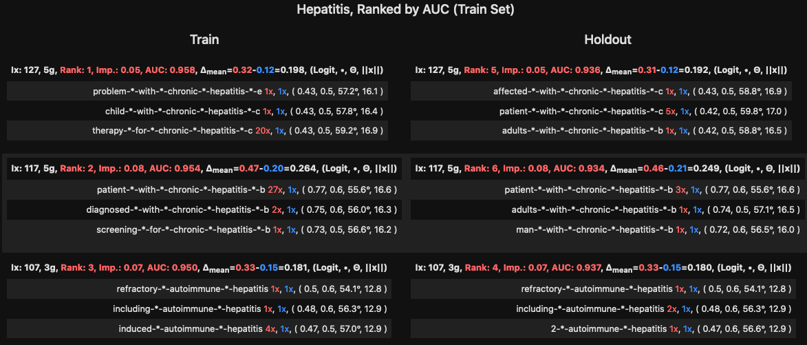

# Red Flag Blue Flag

Red Flag Blue Flag is visualization software for a very [common CNN architecture](https://arxiv.org/abs/1408.5882) in clinical NLP research.

Please see the [Demo Notebook](Demo_Red_Flag_Blue_Flag.ipynb) for how to use Red Flag/Blue Flag.

### Python Version
* 3.10

### Dependencies
* NumPy
* Pandas
* PyTorch
* toolz
* tqdm